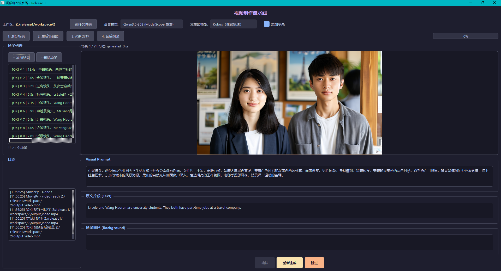

# VidMarmot

> **VidMarmot** — 为英语课本音频配画的 AI 工具。

给一篇课文文本 + 对应的朗读音频，VidMarmot 会自动拆分场景、生成配图、对齐语音时间轴，最终合成一个带字幕的视频。

## 为什么做这个？

老师总让我帮忙做课文视频。一次两次还好，做多了真的烦。

所以我就写了这个工具——把整个流程自动化了：放进去文本和音频，点几下按钮，视频就出来了。

## 主要用途

- **英语课本课文** — 给每篇课文的朗读音频配上场景画面
- **故事类文章** — 自动拆分场景，逐张生成配图
- **教学演示** — 生成带字幕的场景切换视频

```
课文文本 + 朗读音频 → AI 拆分场景 → 逐场景生成配图 → 语音对齐时间轴 → 合成视频（含字幕）
```

## 功能

- **AI 场景划分** — 支持 Qwen / GLM / DeepSeek / 阿里云百炼 / OpenAI 兼容接口
- **AI 文生图** — 支持 Kolors / Qwen-Image 模型，逐张生成场景配图
- **逐张审查** — 每张图生成后可以预览、确认、重新生成或跳过
- **语音对齐** — 基于 Qwen3-ForcedAligner 的 ASR 强制对齐
- **视频合成** — MoviePy 合成最终视频，自动添加字幕

## 预览



## 快速开始

### 环境要求

- Python 3.12+
- Conda
- NVIDIA GPU（本地 ASR 模型需要）

### 安装

```bash
# 创建环境
conda create -n VidMarmot python=3.12 -y
conda activate VidMarmot

# 安装依赖
pip install PyQt6 moviepy Pillow requests openai
pip install funasr modelscope torch torchaudio

# 下载 ASR 模型（约 1.2GB）
python qwen_download.py
```

### 配置 API Key

编辑 `config.py`，在对应模型的 `api_key` 字段填入你的 Key。只需填你用到的服务即可。

| 服务 | 用途 | Key 对应 | 免费额度 |
|------|------|----------|----------|
| ModelScope | LLM + 文生图 | `MODELSCOPE_API_KEY` | 有 |
| 硅基流动 | LLM + 文生图 | `SILICONFLOW_API_KEY` | 有 |
| 阿里云百炼 | LLM (Qwen3-235B) | `DASHSCOPE_API_KEY` | 有 |
| DeepSeek | LLM (V3/R1) | `DEEPSEEK_API_KEY` | 有 |
| OpenAI 兼容 | 自定义 Router | `OPENAI_API_KEY` | - |

### 运行

```bash
python gui.py

# 或 Windows 双击
run.bat
```

### 工作区结构

每个视频项目是一个文件夹：

```
workspace/my_lesson/
├── article.txt          # 课文文本
├── voice.mp3            # 朗读音频
├── scene_plan.json      # 场景计划（自动生成）
├── result.json          # ASR 对齐结果（自动生成）
├── scene/               # 生成的场景图
│   ├── scene_001.png
│   ├── scene_002.png
│   └── ...
└── output_video.mp4     # 最终视频（自动生成）
```

## 项目结构

```
├── gui.py              # PyQt6 GUI（主入口）
├── scene_plan.py       # AI 场景划分 + Prompt 工程
├── image_gen.py        # 文生图 API 调用
├── asr.py              # ASR 强制对齐
├── make_video.py       # 视频合成 + 字幕渲染
├── text_ai.py          # LLM API 客户端
├── config.py           # 配置管理（路径、API、模型）
├── qwen_download.py    # ASR 模型下载脚本
├── run.bat             # Windows 启动脚本
└── .gitignore
```

## 依赖

| 包 | 用途 |
|----|------|
| PyQt6 | GUI 框架 |
| moviepy | 视频合成 |
| Pillow | 图片处理 / 字幕渲染 |
| requests | HTTP API 调用 |
| openai | 兼容 OpenAI 格式的 LLM 客户端 |
| funasr | ASR 强制对齐 |
| modelscope | 模型加载 |
| torch / torchaudio | GPU 推理后端 |

## Roadmap

- [ ] **图生视频** — 用生成的场景图做图生视频，让每张静态图变成动态片段，最终拼接成真正的动态视频
- [ ] 更多文生图模型支持
- [ ] 批量处理多个课文
- [ ] 打包为可执行文件（pyinstaller）

## License

MIT
